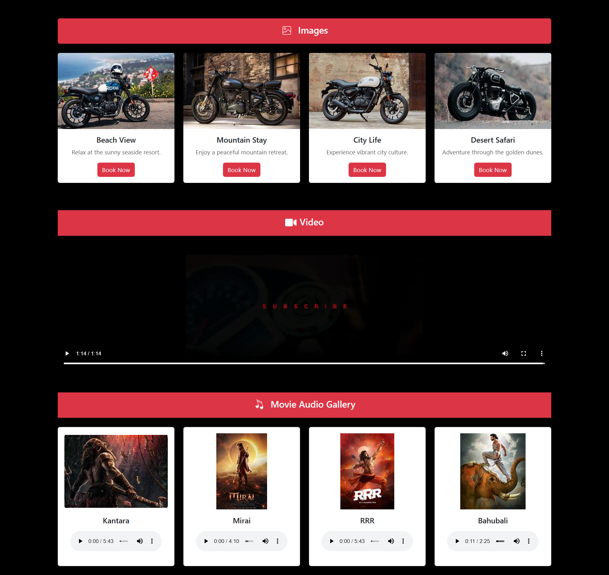

# ⚛️ React Learning Journey

This repository contains my React learning journey, including **assignments and projects** created while practicing React concepts.  
The focus is on building static pages, understanding basic syntax, and using both **Class** and **Functional Components**.

---

## 🚀 What I’ve Learned So Far

### 🧩 React Basics
- Creating a React project using **Vite**
- Understanding project folder structure
- Running the development server
- Writing and using **JSX**
- Creating **Functional Components** and **Class Components**
- Using **Inline** and **External CSS**
- Understanding **List Rendering**

### 🧠 Component Organization
- Splitting UI into reusable components
- Understanding **Parent-Child** relationships
- Importing and exporting components
- Managing component hierarchy and props

---

## 📘 Assignments & Projects

### 🧱 Assignment 3 — Components Static Page
**What I Did:**
- Built a static page using:
  - Functional Components → `Header`, `Banner`, `NewProduct`
  - Class Components → `Icon`, `Footer`

📸 **Screenshot:**  
.png)

---

### 🎨 Assignment 4 — Inline & External CSS + List Rendering
**What I Did:**
- Created a page combining styling and list rendering concepts  
- Used both:
  - Functional Components → `TopNavbar`, `Navbar`, `Banner`
  - Class Components → `CategoriesCard`, `NewArrival`, `Footer`

📸 **Screenshot:**  

---

### 🎬 Assignment 5 — Multimedia & Import/Export Components
**What I Did:**
- Worked with images and videos in React  
- Practiced importing and exporting multiple components

📸 **Screenshot:**  

---

### ⚙️ Assignment 6 — Event Binding
**What I Did:**
- Explored different ways to bind event handlers in Class Components  
- Implemented button click handlers with various binding techniques

📸 **Screenshot:**  
.png)

---

### 🔁 Assignment 7 — Handling Input & Props
**What I Did:**
- Implemented controlled components with state handling  
- Passed data using props between parent and child components

---

### 👁️ Assignment 8 — Conditional Rendering & Styling
**What I Did:**
- Practiced conditional rendering using `if-else` and ternary operators  
- Applied dynamic styles based on state and conditions

---

## 📝 Notes
This repository will be continuously updated as I complete more **React assignments and projects** to strengthen my understanding of real-world React concepts.

---

> 💡 *Next Topics:* Hooks, State Management, and API Integration.
