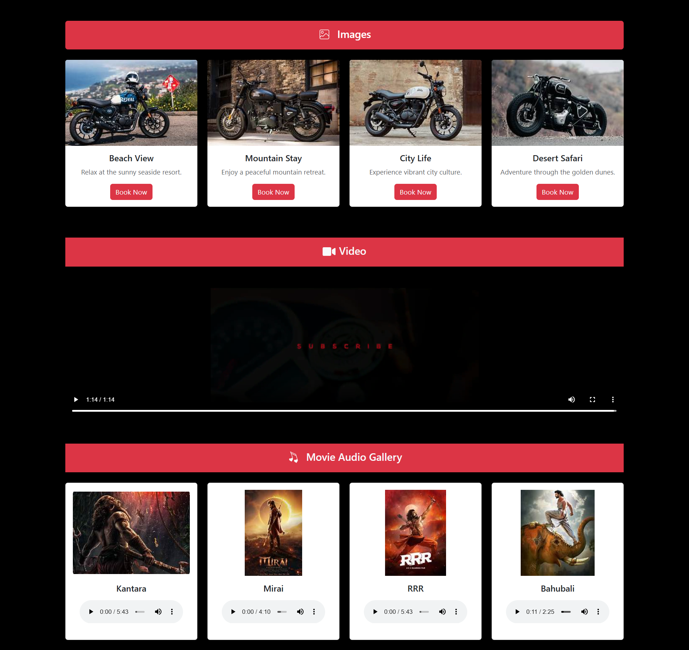

# React Assignment 5

## Overview
This is my **5th React Assignment**, where I practiced:

- Using **import/export** in React components.
- Working with **multiple multimedia files** including images, videos, and audio.
- Accessing data from a `data.json` file located in the **assets** folder.
- Using public folder for static assets.

This project helped me strengthen my understanding of handling **external resources and modular component structure** in React.

---

## Features Implemented

1. **Import/Export Components**
   - Created reusable components and imported them where required.
   - Learned named and default exports.

2. **Working with Multimedia**
   - Added images, videos, and audio files in React.
   - Accessed files from:
     - `src/assets` folder (imported in components)
     - `public` folder (direct path access)

3. **Using JSON Data**
   - Stored data in `data.json` in the `assets` folder.
   - Imported and displayed dynamic data in components using `.map()` function.

---
## Screenshot

Here is how the app looks:

## Project Structure

